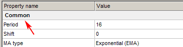

AddSeparator_分隔小标题
==============================

将分隔符(小标题)作为字符串添加到参数对话框中。

**Delphi**

.. code:: delphi

	procedure AddSeparator(text: string);

**C++** >

.. code:: cpp

	void AddSeparator(PChar text);

------------

*代码示例*

**Delphi**

.. code:: delphi

	var
	SMAPeriod: integer;
	SomeText: PChar = nil;	 

	AddSeparator('Common');
	RegOption('SMA period', ot_Integer, SMAPeriod);
	...	 

	AddSeparator('Other parameters');
	RegOption('Description', ot_String, SomeText);
	...

**C++**

.. code:: cpp

	int SMAPeriod;
	PChar SomeText = NULL;
	 

	AddSeparator("Common");
	RegOption("SMA period", ot_Integer, &SMAPeriod);
	...
	 

	AddSeparator("Other parameters");
	RegOption("Description", ot_String, &SomeText);
	...
	...
                                  
    
